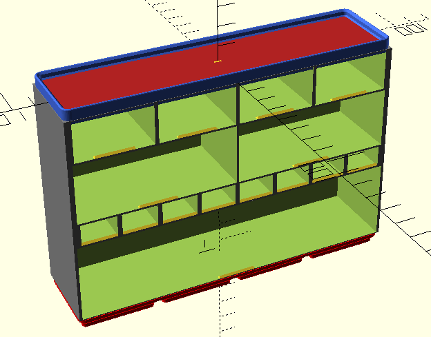
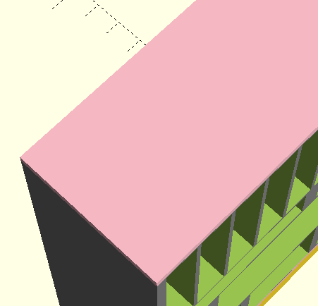
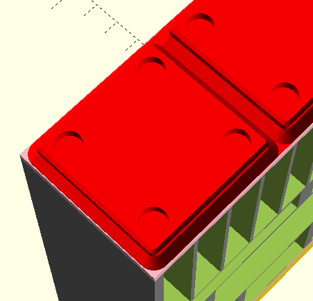
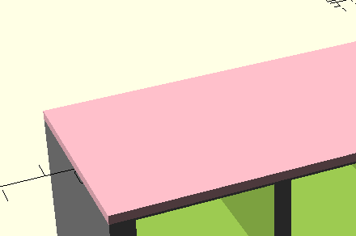
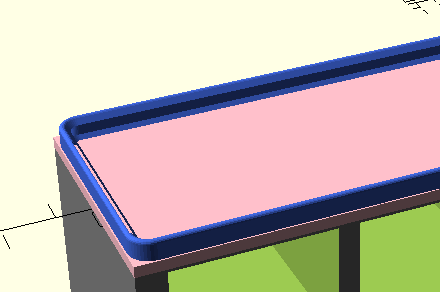
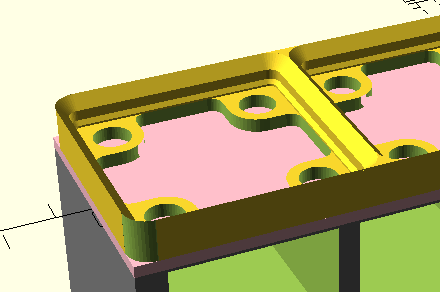
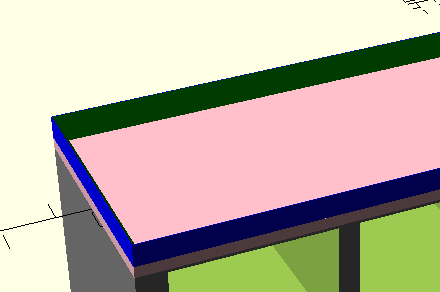

# Cabinets

Cabinets a bit odd,
but helper functions let you
mostly not have to worry about that. :)

```openscad
include <./options.scad>;
use <./cabinet.scad>;
use <./gridfinity-rebuilt-openscad/gridfinity-rebuilt-holes.scad>;

Cabinet(
    gridfinity_footprint=[4, 1],
    grid=grid_expand(
        drawer=drawer_slot_options(
            unit_width=1,
            drawer_height=SMALL
        ),
        rows=3
    ),
    top=surface_options(style=GRIDFINITY_STACKING_TOP),
    base=surface_options(
        style=GRIDFINITY_BASE,
        hole_options=bundle_hole_options(
            magnet_hole=true
        )
    )
);
```

## gridfinity_footprint

This is the x/y footprint of the cabinet,
in GridUnits.
Only positive integers are valid.

## grid

In order to do silly things like this:



We need a bit of a complex configuration structure,
especially given the limited options for
structuring data in OpenSCAD.
That said,
you probably don't need to worry about that.
The helper functions _should_
do most of the heavy lifting for you.

`grid` must be a vector of vectors.
The vector describes the rows,
and each child vector describes a single row,
defining the dimensions for
the drawers that you want in that row.
You probably don't need to know that, though. :)
Use the helper functions to define what you want:

### drawer_slot_options

Similar to [drawer dimensions](./drawers.md#dimensions),
this defines what size drawers you want in a row.

- **unit_width** :
  The width in GridU.
  This can be any positive value you like,
  but I recommend not going smaller than 0.5.
  Yes, fractional drawer slots work.
  No, it does not have to be an exact match.
- **height** :
  The height in mm.
  In `options.scad`,
  you can find some helper values
  that match the original Screwfinity heights:
  - `SMALL` : 20
  - `MEDIUM` : 30
  - `LARGE` : 40

### grid_expand

If you want the same size drawers in every row,
this helper is for you!
It just takes a single drawer definition
and generates as many row configurations as you ask for.

- `drawer` :
  A drawer definition.
  Use [`drawer_slot_options`](#drawer_slot_options)
  to generate this.
- `rows` :
  The number of rows you want.

## base

Defines what you want on the bottom of your cabinet.
Use the `surface_options` helper function
to generate the configuration that you want.

- `style` :
  What kind of base do you want?
  You can find these values in `options.scad`.
  - `NO_BASE` :
    Just a flat base.
    Useful if you want to integrate this model
    into something else
    or want to design your own base.
    
  - `GRIDFINITY_BASE` :
    Gridfinity base, courtesy of
    [Gridfinity Rebuilt](https://github.com/kennetek/gridfinity-rebuilt-openscad).
    
- `hole_options` :
  Options passed to the Gridfinity Rebuilt generator
  if you selected `GRIDFINITY_BASE` for `style`.
  See the
  [source docs](https://github.com/kennetek/gridfinity-rebuilt-openscad/blob/51f1198131ac61fceeab3e38b1d1660b541388e5/gridfinity-rebuilt-holes.scad#L228-L238)
  for instructions on how to use this.


## top

Defines what you want on the top of your cabinet.
Use the `surface_options` helper function
to generate the configuration that you want.

- `style` :
  What kind of top do you want?
  You can find these values in `options.scad`.
  - `NO_TOP` :
    Just a flat top.
    Useful if you want to integrate this model
    into something else
    or want to design your own top.
    
  - `GRIDFINITY_STACKING_TOP` :
    Stacking Gridfinity top, courtesy of
    [Gridfinity Rebuilt](https://github.com/kennetek/gridfinity-rebuilt-openscad/blob/main/docs/bins.md#gridfinityinit)
    using the "regular lip" style.
    
  - `GRIDFINITY_BASEPLATE_MAGNET_TOP` :
    Gridfinity magnet baseplate.
    Great if you want a secure connection
    while stacking Screwfinity cabinets
    (or any other Gridfinity stuff)
    on top of your cabinets.
    
  - `LIP_TOP` :
    Emulates the original Screwfinity top.
    I don't personally recommend this.
    I'm not sure if I just need to tweak some dimensions,
    but it feels too loose and fragile for my liking.
    The Gridfinity stacking top is much stronger,
    and even lightly snaps into place.
    Both are the same height.
    The only downside is that
    [the drawers do not _quite_ fit in the top](
    https://github.com/mattsb42/screwfinity-rebuilt-openscad/issues/16),
    which isn't great if you like to
    put drawers on top of the cabinet.
    
- `hole_options` :
  Does nothing.
  I'm conflicted on whether passing `hole_options` through
  makes sense here.
  For now it does not pass through,
  and the holes are not configurable.
