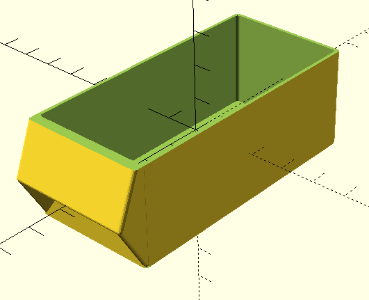
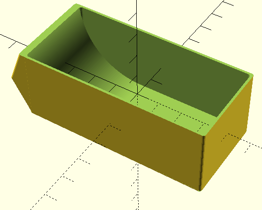
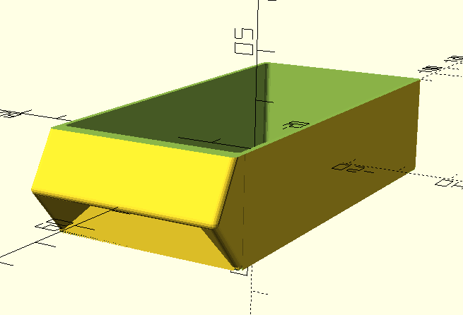
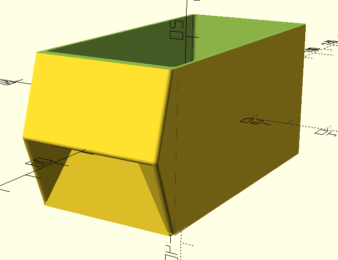
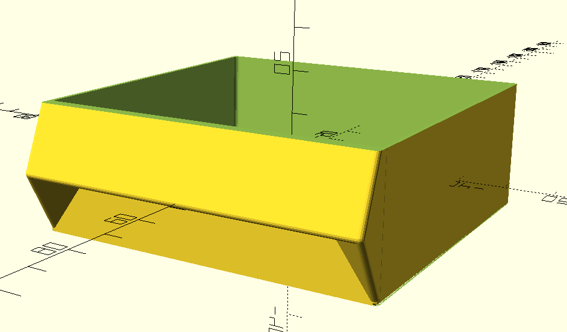
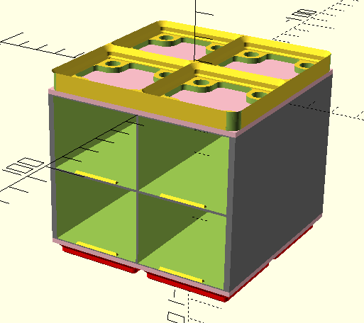
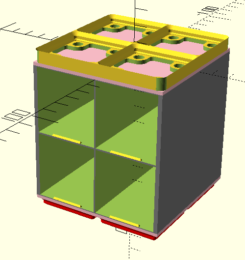
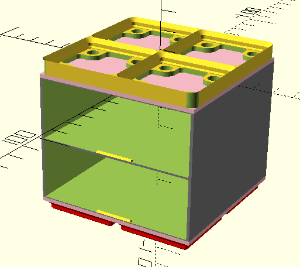

# Description

Generate models compatible with original Screwfinity designs.
These are shown as examples;
for more information,
see [drawers](../docs/drawers.md)
and [cabinets](../docs/cabinets.md).

# Drawers

## Medium Square

1x2x30 square drawer ([Screwfinity Medium 1U](
https://thangs.com/designer/ZombieHedgehog/3d-model/Screwfinity%20Unit%202U%20Medium%20-%20The%20Gridfinity%20Storage%20Unit-1027305
))

### Code

```openscad
include <./options.scad>;
use <./drawer.scad>;

Drawer(
    dimensions=drawer_options(
        unit_width=1,
        unit_depth=2,
        height=MEDIUM
    ),
    fill_type=SQUARE_CUT
);
```

### Generates



## Medium Scoop

1x2x30 scoop drawer ([Screwfinity Medium 1U](
https://thangs.com/designer/ZombieHedgehog/3d-model/Screwfinity%20Unit%202U%20Medium%20-%20The%20Gridfinity%20Storage%20Unit-1027305
))

### Code

```openscad
include <./options.scad>;
use <./drawer.scad>;

Drawer(
    dimensions=drawer_options(
        unit_width=1,
        unit_depth=2,
        height=MEDIUM
    ),
    fill_type=SCOOP_CUT
);
```

### Generates



## Small Scoop

1x2x20 scoop drawer ([Screwfinity Small 1U](
https://thangs.com/designer/ZombieHedgehog/3d-model/Screwfinity%20Unit%202U%20Small%20-%20The%20Gridfinity%20Storage%20Unit-1046954
))

### Code

```openscad
include <./options.scad>;
use <./drawer.scad>;

Drawer(
    dimensions=drawer_options(
        unit_width=1,
        unit_depth=2,
        height=SMALL
    ),
    fill_type=SCOOP_CUT
);
```

### Generates



## Large Scoop

1x2x40 scoop drawer ([Screwfinity Large 1U](
https://thangs.com/designer/ZombieHedgehog/3d-model/Screwfinity%20Unit%202U%20Large%20-%20The%20FREE%20Gridfinity%20Storage%20Unit-1081351
))

### Code

```openscad
include <./options.scad>;
use <./drawer.scad>;

Drawer(
    dimensions=drawer_options(
        unit_width=1,
        unit_depth=2,
        height=LARGE
    ),
    fill_type=SCOOP_CUT
);
```

### Generates



## Medium WIDE

2x2x30 scoop drawer ([Screwfinity 2U Medium WIDE](
https://thangs.com/designer/ZombieHedgehog/3d-model/Screwfinity%20Unit%202U%20Medium%20WIDE%20-%20The%20Gridfinity%20Storage%20Unit-1034369
))

### Code

```openscad
Drawer(
    dimensions=drawer_options(
        unit_width=2,
        unit_depth=2,
        height=MEDIUM
    ),
    fill_type=SCOOP_CUT
);
```

### Generates



# Cabinets

## 2x2 Medium

2x2x2 cabinet for 1Ux30mm drawers
([Screwfinity 2U Medium](
https://thangs.com/designer/ZombieHedgehog/3d-model/Screwfinity%20Unit%202U%20Medium%20-%20The%20Gridfinity%20Storage%20Unit-1027305
)),
with Gridfinity top and base

### Code

```openscad
include <./options.scad>;
use <./cabinet.scad>;

Cabinet(
    gridfinity_footprint=[2, 2],
    grid=grid_expand(
        drawer=drawer_slot_options(
            unit_width=1,
            height=MEDIUM
        ),
        rows=2
    ),
    top=surface_options(style=GRIDFINITY_BASEPLATE_MAGNET_TOP),
    base=surface_options(style=GRIDFINITY_BASE)
);
```

### Generates



## 2x2 Large

2x2x2 cabinet for 1Ux40mm drawers
([Screwfinity 2U Large](
https://thangs.com/designer/ZombieHedgehog/3d-model/Screwfinity%20Unit%202U%20Large%20-%20The%20FREE%20Gridfinity%20Storage%20Unit-1081351
)),
with Gridfinity top and base

### Code

```openscad
include <./options.scad>;
use <./cabinet.scad>;

Cabinet(
    gridfinity_footprint=[2, 2],
    grid=grid_expand(
        drawer=drawer_slot_options(
            unit_width=1,
            height=LARGE
        ),
        rows=2
    ),
    top=surface_options(style=GRIDFINITY_BASEPLATE_MAGNET_TOP),
    base=surface_options(style=GRIDFINITY_BASE)
);
```

### Generates



## 2x2 Medium WIDE

2x2x2 cabinet for 2Ux30mm drawers
([Screwfinity 2U Medium WIDE](
https://thangs.com/designer/ZombieHedgehog/3d-model/Screwfinity%20Unit%202U%20Medium%20WIDE%20-%20The%20Gridfinity%20Storage%20Unit-1034369
)),
with Gridfinity top and base

### Code

```openscad
include <./options.scad>;
use <./cabinet.scad>;

Cabinet(
    gridfinity_footprint=[2, 2],
    grid=grid_expand(
        drawer=drawer_slot_options(
            unit_width=2,
            height=MEDIUM
        ),
        rows=2
    ),
    top=surface_options(style=GRIDFINITY_BASEPLATE_MAGNET_TOP),
    base=surface_options(style=GRIDFINITY_BASE)
);
```

### Generates


