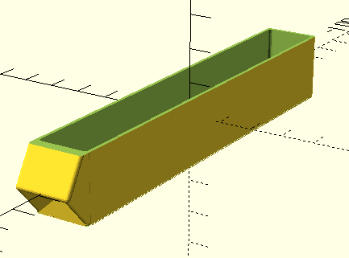
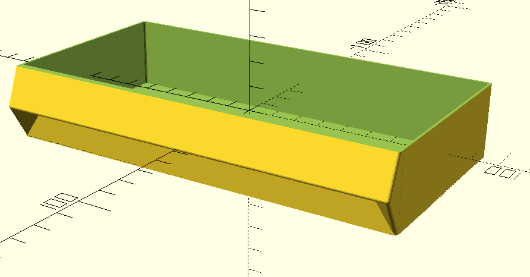
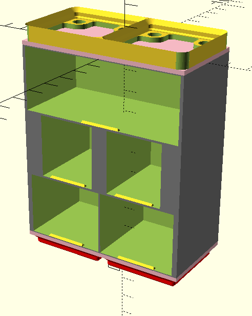
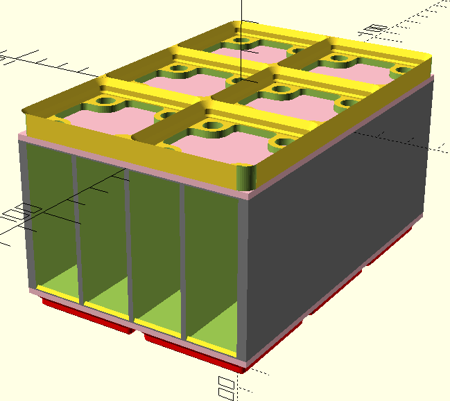
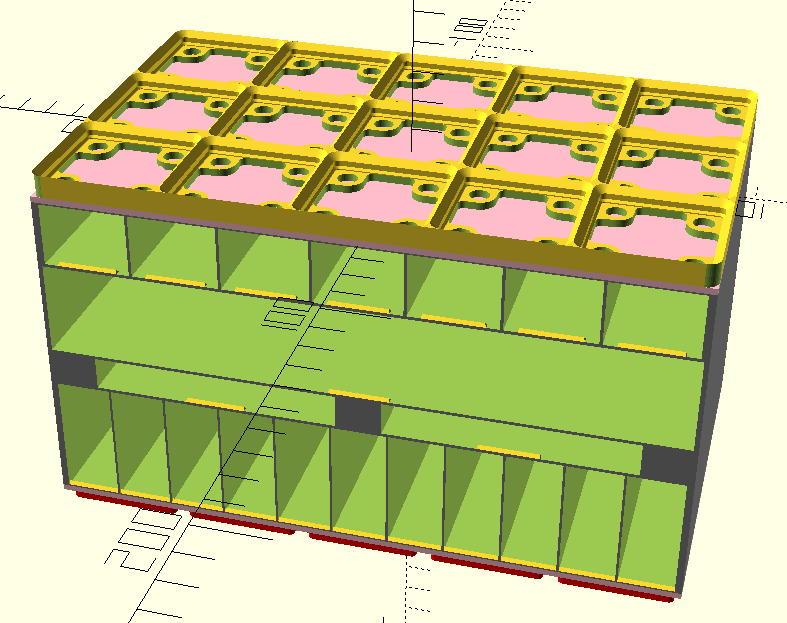

# Description

These are some examples of
some things that would be very difficult
without an algorithmic generator,
but are very simple now that we have one. :)

## Fractional Drawers

Got some really small but really long parts?
How about a 0.5x3x20 drawer?

### Code

```openscad
Drawer(
    dimensions=drawer_options(
        unit_width=0.5,
        unit_depth=3,
        height=20
    ),
    fill_type=SCOOP_CUT
);
```

### Generates



## Huge Drawers

Want to store your
[Pinecil](https://pine64.com/product/pinecil-smart-mini-portable-soldering-iron/)
in a Screwfinity station
along with its bits?
How about a super wide, 4x2x30 drawer?

### Code

```openscad
Drawer(
    dimensions=drawer_options(
        unit_width=4,
        unit_depth=2,
        height=30
    ),
    fill_type=SQUARE_CUT
);
```

### Generates



## Sparse Rows

Sometimes you might want unusual drawer widths.
Maybe you need to store something unusual.
Maybe you want to put extra supports on a row.
Whatever your reason, you can!

Let's make a very shallow cabinet
that can fit some very specific drawers.

### Code

```openscad
Cabinet(
    gridfinity_footprint=[2, 1],
    grid=[
        drawer_slot_options(unit_width=2, height=MEDIUM),
        drawer_slot_options(unit_width=0.75, height=MEDIUM),
        drawer_slot_options(unit_width=1, height=MEDIUM),
    ],
    top=surface_options(style=GRIDFINITY_BASEPLATE_MAGNET_TOP),
    base=surface_options(style=GRIDFINITY_BASE)
);
```

### Generates



## Cards

Let's say I wanted to store
my business cards in a Screwfinity cabinet.
Shh, don't ask questions.

### Code

```openscad
Cabinet(
    gridfinity_footprint=[2, 3],
    grid=[
        drawer_slot_options(unit_width=0.5, height=50),
    ],
    top=surface_options(style=GRIDFINITY_BASEPLATE_MAGNET_TOP),
    base=surface_options(style=GRIDFINITY_BASE)
);
```

### Generates



## Overboard

Ok, we've done some sensible things,
some probably silly things.
Let's say you wanted something...much more specific.
IDK, maybe there's a good reason,
I won't judge.

### Code

```autoscad
Cabinet(
    gridfinity_footprint=[5, 3],
    grid=[
        drawer_slot_options(unit_width=.75, height=SMALL),
        drawer_slot_options(unit_width=5, height=MEDIUM),
        drawer_slot_options(unit_width=2, height=10),
        drawer_slot_options(unit_width=0.5, height=LARGE),
    ],
    top=surface_options(style=GRIDFINITY_BASEPLATE_MAGNET_TOP),
    base=surface_options(style=GRIDFINITY_BASE)
);
```

### Generates


