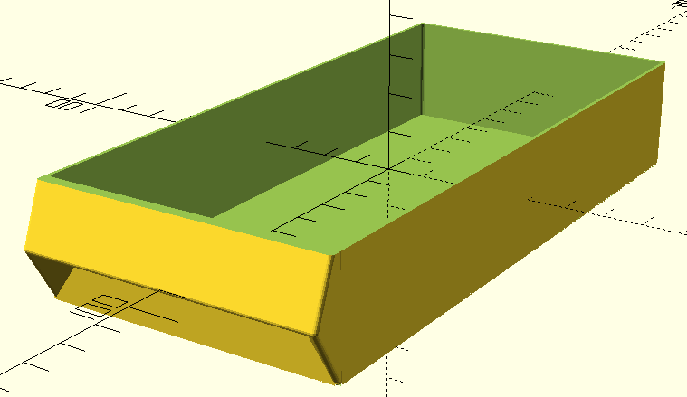
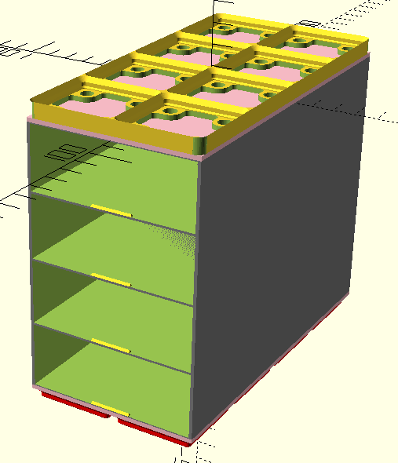

# Description

Generate models compatible with this
[Screwfinity Medium Wide 4U](
https://thangs.com/designer/Myrmecodia/3d-model/Screwfinity%20Medium%20Wide%204U%20drawer%20set-1097859)
variant.

# Drawer

### Code

```openscad
include <./options.scad>;
use <./drawer.scad>;

Drawer(
    dimensions=drawer_options(
        unit_width=2,
        unit_depth=4,
        height=MEDIUM
    ),
    fill_type=SCOOP_CUT
);
```

### Generates



# 2x4 Cabinet

### Code

```openscad
include <./options.scad>;
use <./cabinet.scad>;

Cabinet(
    gridfinity_footprint=[2, 4],
    grid=grid_expand(
        drawer=drawer_slot_options(
            unit_width=2,
            height=MEDIUM
        ),
        rows=4
    ),
    top=surface_options(style=GRIDFINITY_BASEPLATE_MAGNET_TOP),
    base=surface_options(style=GRIDFINITY_BASE)
);
```

### Generates


